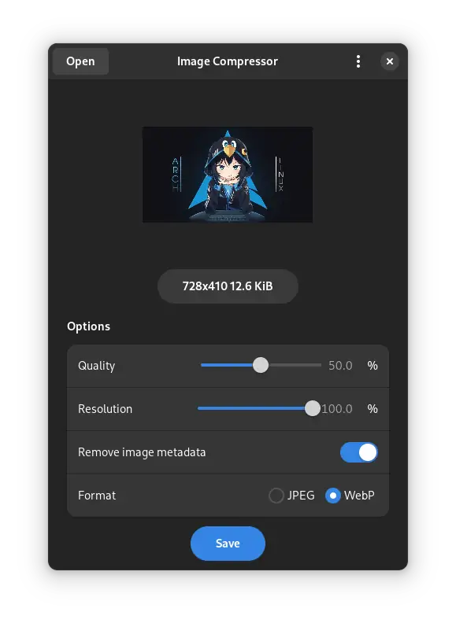

  <h1>Image Compressor</h1>
  A GTK4 app to compress images using pillow

## Building:

- **Requirements**

 <i>python-pillow</i>

- **Build**

 <i>meson build --prefix=/usr</i>

 <i>cd build</i>

 <i>sudo ninja install</i>
